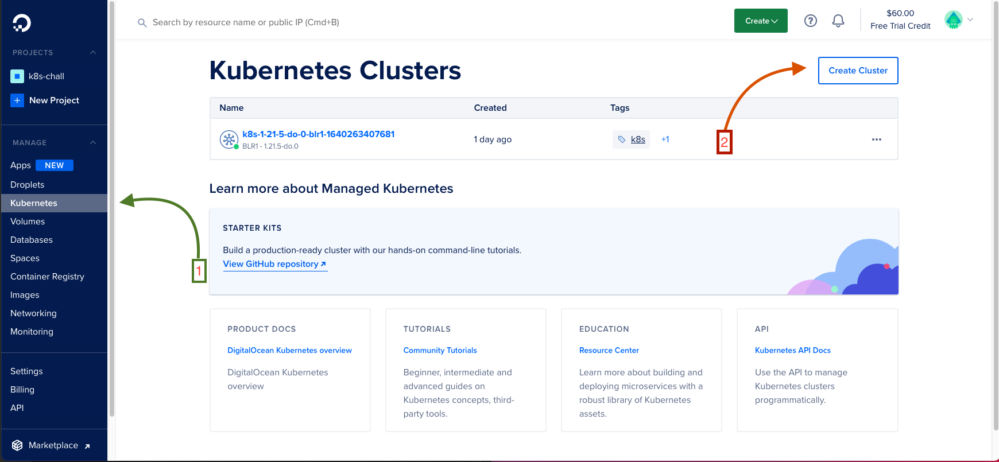

# Deploying a Scalable SQL Database Cluster to a DigitalOcean Managed Kubernetes Cluster 🌟

## Steps to Follow:

- Provision the Kubernetes Cluster on Digital Ocean
- Authenticate and connect to the provisioned Kubernetes cluter  
- Set up MySQL Database and MySQL Operator
- Test the cluster for Resiliance and Scalibility

---

## Notes:

- The default limit on the maximum number of DigitalOcean droplets is 1. Since, a cluster requires more than 1 node to function correctly, I had to file a support ticket to raise the limit to 3. 

- Likewise, each of these nodes require a seperate DigitalOcean volume but the maximum number is only 1 by default. I did not know this and kept getting the following error:
```
Patching failed with inconsistencies: (('remove', ('status', 'kopf'), {'dummy': '2021-12-23T12:59:18.868356'}, None),) 0/3 nodes are available: 3 pod has unbound immediate PersistentVolumeClaims.
```
I reached out to DigitalOcean support for it and they prompty raised the limit to 3 for it as well. This was their response:
```
I completely understand your concern here. On looking at your cluster with the name "k8s-1-21-5-do-0-blr1-1640263407681" I could see that your pods are unable to mount the volume due to the volume limit on your account. I could see that the volume limit is set to 1 for your account and you have already provisioned a volume for your PVC named "datadir-mycluster-0" in default namespace. I will be moving this ticket to our Developer Experience team who can better assist with the volume limit increase part. 
```

---

## Provisioning the Kubernetes Cluster on Digital Ocean


1. From the DigitalOcean dashboard, click on the Kubernetes tab.
2. Click on the Create Cluster button and keep the default settings. 

It will take about 4-5 minutes to provision a cluster.


## Authenticating and connecting to the provisioned Kubernetes cluter 

1. Download doctl for your respective host OS using the guide: https://docs.digitalocean.com/reference/doctl/how-to/install/

2. Authenticate your shell using:
```
$ doctl auth init
```
output:
```bash
ashok@Ashoks-Mac-mini ~ % doctl auth init
Please authenticate doctl for use with your DigitalOcean account. You can generate a token in the control panel at https://cloud.digitalocean.com/account/api/tokens

Enter your access token:
Validating token... OK
```

3. Connect to the provisioned cluster using:
```bash
doctl kubernetes cluster kubeconfig save <cluster-id>
```
output:
```bash
ashok@Ashoks-Mac-mini ~ % doctl kubernetes cluster kubeconfig save b03b0a9b-1f2d-463e-a020-ea66566e57b2
Notice: Adding cluster credentials to kubeconfig file found in "/Users/ashok/.kube/config"
Notice: Setting current-context to do-sfo3-k8s-1-21-5-do-0-sfo3-1640244342821
```
and check that the current context is your k8s cluster:
```bash
$ kubectl config current-context
```
output:
```bash
ashok@Ashoks-Mac-mini ~ % kubectl config current-context
do-sfo3-k8s-1-21-5-do-0-sfo3-1640244342821
```
## Setting up MySQL Database and MySQL Operator 

1. Install MySQL Operator using:
```bash
$ kubectl apply -f https://raw.githubusercontent.com/mysql/mysql-operator/trunk/deploy/deploy-crds.yaml
```
output:
```bash
ashok@Ashoks-Mac-mini ~ % kubectl apply -f https://raw.githubusercontent.com/mysql/mysql-operator/trunk/deploy/deploy-crds.yaml
customresourcedefinition.apiextensions.k8s.io/innodbclusters.mysql.oracle.com created
customresourcedefinition.apiextensions.k8s.io/mysqlbackups.mysql.oracle.com created
customresourcedefinition.apiextensions.k8s.io/clusterkopfpeerings.zalando.org created
customresourcedefinition.apiextensions.k8s.io/kopfpeerings.zalando.org created

```
followed by:
```bash
$ kubectl apply -f https://raw.githubusercontent.com/mysql/mysql-operator/trunk/deploy/deploy-operator.yaml
```
output:
```bash
ashok@Ashoks-Mac-mini ~ % kubectl apply -f https://raw.githubusercontent.com/mysql/mysql-operator/trunk/deploy/deploy-operator.yaml
serviceaccount/mysql-sidecar-sa created
clusterrole.rbac.authorization.k8s.io/mysql-operator created
clusterrole.rbac.authorization.k8s.io/mysql-sidecar created
clusterrolebinding.rbac.authorization.k8s.io/mysql-operator-rolebinding created
clusterkopfpeering.zalando.org/mysql-operator created
namespace/mysql-operator created
serviceaccount/mysql-operator-sa created
deployment.apps/mysql-operator created
```

2. Create password for MySQL cluster:
```bash
$ kubectl create secret generic mypwds \
        --from-literal=rootUser=root \
        --from-literal=rootHost=% \
        --from-literal=rootPassword="<enter-a-secret-password>"
```
output:
```bash
ashok@Ashoks-Mac-mini ~ % kubectl create secret generic mypwds \
        --from-literal=rootUser=root \
        --from-literal=rootHost=% \
        --from-literal=rootPassword="password123"

secret/mypwds created
```

3. Create `mysql-cluster.yaml` config file for the cluster:
```bash
apiVersion: mysql.oracle.com/v2alpha1
kind: InnoDBCluster
metadata:
  name: mycluster
spec:
  secretName: mypwds
  instances: 3
  router:
    instances: 1
```
and deploy it using:
```bash
$ kubectl apply -f mysql-cluster.yaml
```
output:
```bash
ashok@Ashoks-Mac-mini ~ % kubectl apply -f mysql-cluster.yaml
innodbcluster.mysql.oracle.com/mycluster created
```

Watch the pods slowly come alive using:
```bash
ashok@Ashoks-Mac-mini ~ % kubectl get innodbcluster --watch

NAME        STATUS    ONLINE   INSTANCES   ROUTERS   AGE
mycluster   PENDING   0        3           1         15s
mycluster   PENDING   0        3           1         72s
mycluster   INITIALIZING   0        3           1         72s
mycluster   INITIALIZING   0        3           1         72s
mycluster   INITIALIZING   0        3           1         72s
mycluster   INITIALIZING   0        3           1         72s
mycluster   INITIALIZING   0        3           1         78s
mycluster   ONLINE         1        3           1         78s
```
4. Port-forward the cluster to acess the database:
```bash
$ kubectl port-forward service/mycluster mysql
```
output:
```bash
ashok@Ashoks-Mac-mini ~ % kubectl port-forward service/mycluster mysql

Forwarding from 127.0.0.1:6446 -> 6446
Forwarding from [::1]:6446 -> 6446
Handling connection for 6446
Handling connection for 6446
```
## Testing the cluster for Resiliance and Scalibility
1. Connect to the MySQL cluster:
```sql
$ mysql -h127.0.0.1 -P6446 -u root -p
```
2. Get a list of existing databases:

```sql
mysql> show databases;
+-------------------------------+
| Database                      |
+-------------------------------+
| information_schema            |
| mysql                         |
| mysql_innodb_cluster_metadata |
| performance_schema            |
| sys                           |
+-------------------------------+
5 rows in set (0.16 sec)
```
3. Use `mysql` database:
```sql
mysql> use mysql;
Reading table information for completion of table and column names
You can turn off this feature to get a quicker startup with -A

Database changed
```
4. Create a new table:
```sql
mysql> CREATE TABLE students (id INT(3) PRIMARY KEY, name VARCHAR(20) NOT NULL, dept VARCHAR(5) NOT NULL);
Query OK, 0 rows affected, 1 warning (0.25 sec)
```
5. Insert a row into this newly created table:
```sql
mysql> INSERT INTO students VALUES (1, "Ashok", "CSE");
Query OK, 1 row affected (0.18 sec)
```
6. Get all rows from the table:
```sql
mysql> select * from students;
+----+-------+------+
| id | name  | dept |
+----+-------+------+
|  1 | Ashok | CSE  |
+----+-------+------+
1 row in set (0.15 sec)
```
7. Find the pod name for the current connection:
```sql
mysql> SHOW VARIABLES WHERE Variable_name = 'hostname';
+---------------+-------------+
| Variable_name | Value       |
+---------------+-------------+
| hostname      | mycluster-0 |
+---------------+-------------+
1 row in set (0.16 sec)
```
8. Delete the pod using the pod name from the previous command:
(This command runs in shell)
```bash
$ kubectl delete pod mycluster-0
```
output:
```shell
ashok@Ashoks-Mac-mini ~ % kubectl delete pod mycluster-0
pod "mycluster-0" deleted
```
9. Find the pod name for the current connection:

Since the pod was deleted, the connection was lost, and a new connection was initiated with a different pod in the same cluster.
```sql
mysql> SHOW VARIABLES WHERE Variable_name = 'hostname';
ERROR 2013 (HY000): Lost connection to MySQL server during query
No connection. Trying to reconnect...
Enter password:
Connection id:    1678
Current database: mysql

+---------------+-------------+
| Variable_name | Value       |
+---------------+-------------+
| hostname      | mycluster-1 |
+---------------+-------------+
1 row in set (11.31 sec)

```
10. Get all rows from the table:
```sql
mysql> select * from students;
+----+-------+------+
| id | name  | dept |
+----+-------+------+
|  1 | Ashok | CSE  |
+----+-------+------+
1 row in set (0.15 sec)
```

Notice that this pod also contains the same data and that the database is resiliant against pod failure issues. 🎉🎉

Moving on to the scalibility:

11. Create a new `mysql-cluster.yaml` file with 1 more instance, (instances: 3 => instances: 4):
```yaml
apiVersion: mysql.oracle.com/v2alpha1
kind: InnoDBCluster
metadata:
  name: mycluster
spec:
  secretName: mypwds
  instances: 4
  router:
    instances: 1
```

12. Apply the modified configuration file:

```bash
$ kubectl apply -f mysql-cluster.yaml
```
output:
```bash
ashok@Ashoks-Mac-mini Desktop % kubectl apply -f mysql-cluster.yaml.yaml
innodbcluster.mysql.oracle.com/mycluster configured
```

and then another instance of it will be created:
```bash
ashok@Ashoks-Mac-mini Desktop % kubectl get innodbcluster --watch
NAME        STATUS   ONLINE   INSTANCES   ROUTERS   AGE
mycluster   ONLINE   3        4           1         43h
```

Since my droplet and volume limit was only 3, I wasn't able to up-scale but this will work.
Hence, it is possible to scale the cluster. ✨✨
